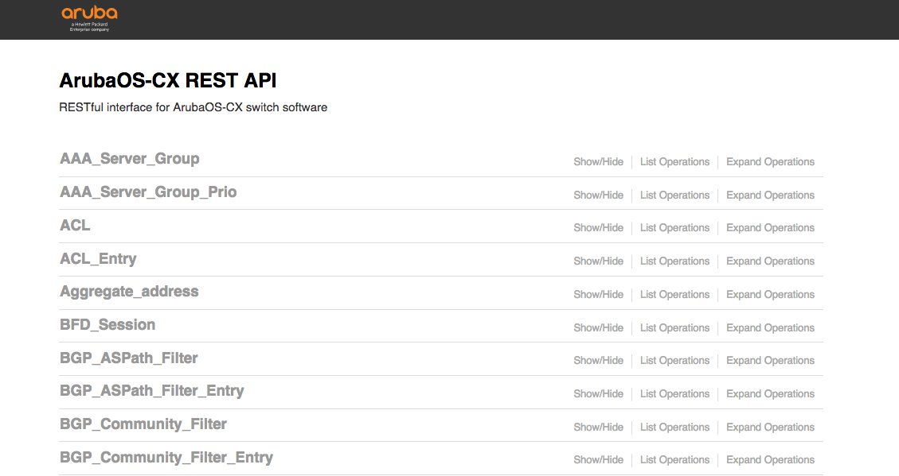

# PowerArubaCX

This is a Powershell module for configure a ArubaCX Switch.

With this module (version 0.3.0) you can manage:

- Invoke API using Invoke-ArubaCXRestMethod
- System (Get)
- Interfaces (Get)
- LLDP Neighbor (Get)

More functionality will be added later.

Tested with ArubaCX 8400 and 8320, 6x00 (using >= 10.04.xx firmware) on Windows/Linux/macOS

# Usage

All resource management functions are available with the Powershell verbs GET, ADD, SET, REMOVE.
<!--
For example, you can manage Vlans with the following commands:
- `Get-ArubaCXVlans`
- `Add-ArubaCXVlans`
- `Set-ArubaCXVlans`
- `Remove-ArubaCXVlans`
-->

# Requirements

- Powershell 6 (Core) or 5 (If possible get the latest version)
- An ArubaCX Switch (with firmware >= 10.04.xx) and REST API enable

# Instructions
### Install the module
```powershell
# Automated installation (Powershell 5 and later):
    Install-Module PowerArubaCX

# Import the module
    Import-Module PowerArubaCX

# Get commands in the module
    Get-Command -Module PowerArubaCX

# Get help
    Get-Help Invoke-ArubaCXRestMethod -Full
```

# Examples
### Connecting to the Aruba Switch

The first thing to do is to connect to a Aruba Switch with the command `Connect-ArubaCX`:

```powershell
# Connect to the Aruba CX Switch
    Connect-ArubaCX 192.0.2.1

#we get a prompt for credential
```

<!--
### Vlans Management

You can create a new Vlan `Add-ArubaSWVlans`, retrieve its information `Get-ArubaSWVlans`, modify its properties `Set-ArubaSWVLans`, or delete it `Remove-ArubaSWVlans`.

```powershell
# Create a vlan
    Add-ArubaSWVlans -id 85 -Name 'PowerArubaSW' -is_voice_enabled

    uri               : /vlans/85
    vlan_id           : 85
    name              : PowerArubaSW
    status            : VS_PORT_BASED
    type              : VT_STATIC
    is_voice_enabled  : False
    is_jumbo_enabled  : True
    is_dsnoop_enabled : False


# Get information about vlan
    Get-ArubaSWVlans -name PowerArubaSW | ft

    uri       vlan_id name         status        type      is_voice_enabled is_jumbo_enabled is_dsnoop_enabled is_management_vlan
    ---       ------- ----         ------        ----      ---------------- ---------------- ----------------- ------------------
    /vlans/85      85 PowerArubaSW VS_PORT_BASED VT_STATIC            False             True             False              False


# Remove a vlan
    Remove-ArubaSWVlans -id 85
```
-->
### Invoke API
for example to get ArubaCX System Configuration

```powershell
# get Aruba CX System configuration using API
    Invoke-ArubaCXRestMethod -method "get" -uri "system" -selector configuration

aaa                                : @{fail_through=False; login_lockout_time=300; radius_auth=pap; radius_retries=1;
                                     radius_timeout=5; ssh_passkeyauthentication_enable=True;
                                     ssh_publickeyauthentication_enable=True; tacacs_auth=pap; tacacs_timeout=5}
all_user_copp_policies             : {}
arp_config                         : @{gc_threshold=131072; timeout=30}
bfd_detect_multiplier              : 5
bfd_echo_disable                   : False
bfd_enable                         : False
bfd_min_echo_rx_interval           : 500
bfd_min_rx_interval                : 3000
bfd_min_tx_interval                : 3000
checkpoint_post_config             : @{disable=False; timeout=300}
dhcp_config                        :
dlog_destination                   :
dns_servers                        : {}
ecmp_config                        :
hostname                           : PowerArubaCX-SW1
hpe_rda_enable                     : False
icmp_redirect_disable              : False
icmp_unreachable_disable           : False
icmp_unreachable_ratelimit         : 1000

[...]
# get only Aruba CX System hostname and dns servers
    Invoke-ArubaCXRestMethod -method "get" -uri "system" -attributes hostname, dns_servers

dns_servers hostname
----------- --------
{}          PowerArubaCX-SW1

# get only Aruba CX Interfaces with depth 21 and attributes name...
    Invoke-ArubaCXRestMethod -method "get" -uri "system/interfaces" -depth 2 -attributes name, admin

name          admin
----          ------
bridge_normal @{error=up}
1/1/1         @{error=up}
vlan55        @{error=up}
1/1/3         @{error=up}
1/1/2         @{error=up}
lag1          @{error=up}
lag2          @{error=up}
lag5          @{error=up}
1/1/6         @{error=up}

```
to get API uri, go to ArubaCX Swagger (https://ArubaCX-IP/api/v10.04/)


And choice a service (for example System)


### Interface
for example to get ArubaCX Interface

```powershell

#Get interface configuration
    Get-ArubaCXinterfaces -depth 1 -selector configuration | Format-Table

options other_config              udld_arubaos_compatibility_mode udld_compatibility udld_enable udld_interval udld_retries udld_rfc5171_compat
                                                                                                                            ibility_mode
------- ------------              ------------------------------- ------------------ ----------- ------------- ------------ -------------------
                                  forward_then_verify             aruba_os                 False          7000            4 normal
                                  forward_then_verify             aruba_os                 False          7000            4 normal
                                  forward_then_verify             aruba_os                 False          7000            4 normal
                                  forward_then_verify             aruba_os                 False          7000            4 normal
                                  forward_then_verify             aruba_os                 False          7000            4 normal
        @{lacp-aggregation-key=1} forward_then_verify             aruba_os                 False          7000            4 normal
        @{lacp-aggregation-key=1} forward_then_verify             aruba_os                 False          7000            4 normal
                                  forward_then_verify             aruba_os                 False          7000            4 normal


#Get name, admin state and link state of interface

    Get-ArubaCXinterfaces -depth 1 -attributes name, admin_state, link_state

admin_state link_state name
----------- ---------- ----
up          up         bridge_normal
up          up         1/1/1
down        down       1/1/4
down        down       1/1/3
down        down       1/1/2
up          up         1/1/5
up          up         1/1/6
up          up         vlan55
```

### Disconnecting

```powershell
# Disconnect from the Aruba CX Switch
    Disconnect-ArubaCX
```

# List of available command
```powershell
Connect-ArubaCX
Disconnect-ArubaCX
Get-ArubaCXInterfaces
Get-ArubaCXLLDPNeighbor
Get-ArubaCXSystem
Invoke-ArubaCXRestMethod
Set-ArubaCXCipherSSL
Set-ArubaCXuntrustedSSL
Show-ArubaCXException
```

# Author

**Alexis La Goutte**
- <https://github.com/alagoutte>
- <https://twitter.com/alagoutte>

# Special Thanks

- Warren F. for his [blog post](http://ramblingcookiemonster.github.io/Building-A-PowerShell-Module/) 'Building a Powershell module'
- Erwan Quelin for help about Powershell

# License

Copyright 2018 Alexis La Goutte and the community.
